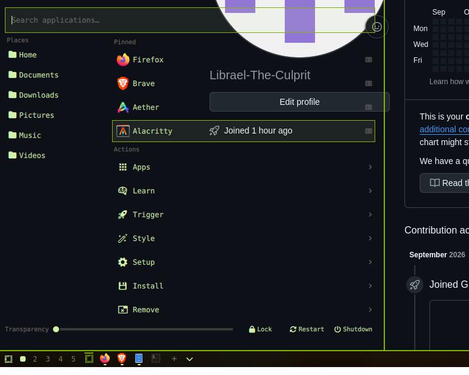

# Simple Start Menu

A Plasma/Windows-style start menu for Omarchy (Hyprland). Launched from a bar
button, it gives you a Kickoff-like app launcher with search, pinned apps,
places, and the omarchy menu's sections in one place.



## Features

- **Search** – type anywhere in the popup to search installed apps and open a
  result with Enter.
- **Places** – one-click access to Home, Documents, Downloads, Pictures, Music,
  Videos and other XDG user directories.
- **Pinned apps** – right-click any app (search result, pinned row or menu
  entry) to pin or unpin it. Pins persist across sessions.
- **Actions** – the omarchy menu's sections (Apps, Style, Install, Setup,
  Trigger, ...) are browsable with drilldown, honouring the same
  `when:`/`checked:` visibility rules as the built-in menu.
- **Session controls** – lock, logout, restart and shutdown.
- **Opacity** – a slider in the footer sets card transparency and remembers it.

## Install

From the marketplace, copy the install command shown on the plugin page, or add
it directly from the repository:

```sh
omarchy plugin add <repository-url> --enable
```

The widget is a `bar-widget` placed in the bar's default section. If it does not
appear after enabling, run `omarchy plugin list` to confirm it is enabled, then
`omarchy restart shell`.

## Remove

```sh
omarchy plugin remove io.github.librael-the-culprit.simple-start-menu
```

Removal disables the plugin first, then deletes the checkout. The upstream
repository is unaffected.

## State

Pinned apps and the opacity setting are stored under
`~/.local/state/omarchy/io.github.librael-the-culprit.simple-start-menu/`
(`pinned` and `opacity`). Deleting a file resets that setting to its default.

## Compatibility

Built and tested on Omarchy Quattro. The menu tree is read from
`omarchy-menu.jsonc` (ship default plus user overrides), so the sections you can
browse depend on what your Omarchy install exposes. `MenuModel.js` is a copy of
the built-in menu parser and needs no extra dependencies.

## License

MIT. See [LICENSE](LICENSE).